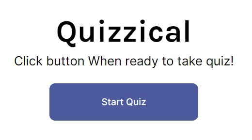

This is a solution to the [Scrimba's 2021 react course final project by Bob ziroll](https://scrimba.com/learn/learnreact/section-4-solo-project-co24f49bea8aace7c174082c8).

## Table of contents

- [Overview](#overview)
  - [The challenge](#the-challenge)
  - [Screenshot](#screenshot)
  - [Links](#links)
- [My process](#my-process)
  - [Built with](#built-with)
  - [What I learned](#what-i-learned)
  - [Continued development](#continued-development)
  - [Useful resources](#useful-resources)
- [Author](#author)
- [Acknowledgments](#acknowledgments)

## Overview

### The challenge

Users should be able to:

- Choose the answer for 5 questions
- Get a score based on their performance on the quiz

### Screenshot

### Links

- Solution URL: [Github](https://github.com/AlbertoCastroF/countriesAPI)
- Live Site URL: [GithupPages](https://albertocastrof.github.io/countriesAPI)

## My process

The challenge in this project was figuring our how to display the feedback on the answers once they were submitted by the user. I decided that i would create new properties in each of the question returned by the API to keep track of the answer selected by the user to campare it with the correct answer contained in the data. Everytime the user selects an answer, the value of the answer will be stored in a property inside the question objects in the data to keep track of it. New properties will be created to keep track of the right of wrong answers as well.

Another challenge in the projects was to randomize the values of the answers in each queastion object since they always come in the same order everytime. This is solved with a function I created called setRandomAnswers wich basically creates an array with indexes, then chooses a random index from thath array, this random index is then used to grab one value from an array that contains all answers in order, then I erase the index used so the function doesnt return the same value.

### Built with

- Semantic HTML5 markup
- CSS custom properties
- Flexbox
- [React](https://reactjs.org/) - JS library

### What I learned

I made this project maninly as a refresher for my react knowledge and improvemnet of my programming logic.

### Continued development

I look forward to create more simple apps like this one because they are very helpful when it comes to consolidate knowledge.

### Useful resources

- [React Router Guide](https://reactrouter.com/web/guides/quick-start) - Everything about react router.
- [UseEffect article](https://overreacted.io/a-complete-guide-to-useeffect/#dont-lie-to-react-about-dependencies) - A guide to understand useEffect better.

## Author

- Website - [Alberto Castro Flores](https://www.linkedin.com/in/alberto-castro-flores-02007959/)

## Acknowledgments

Thanks to scrimba community for the continuous support 🙏!

# Getting Started with Create React App

This project was bootstrapped with [Create React App](https://github.com/facebook/create-react-app).

## Available Scripts

In the project directory, you can run:

### `npm start`

Runs the app in the development mode.\
Open [http://localhost:3000](http://localhost:3000) to view it in the browser.

The page will reload if you make edits.\
You will also see any lint errors in the console.

### `npm test`

Launches the test runner in the interactive watch mode.\
See the section about [running tests](https://facebook.github.io/create-react-app/docs/running-tests) for more information.

### `npm run build`

Builds the app for production to the `build` folder.\
It correctly bundles React in production mode and optimizes the build for the best performance.

The build is minified and the filenames include the hashes.\
Your app is ready to be deployed!

See the section about [deployment](https://facebook.github.io/create-react-app/docs/deployment) for more information.

### `npm run eject`

**Note: this is a one-way operation. Once you `eject`, you can’t go back!**

If you aren’t satisfied with the build tool and configuration choices, you can `eject` at any time. This command will remove the single build dependency from your project.

Instead, it will copy all the configuration files and the transitive dependencies (webpack, Babel, ESLint, etc) right into your project so you have full control over them. All of the commands except `eject` will still work, but they will point to the copied scripts so you can tweak them. At this point you’re on your own.

You don’t have to ever use `eject`. The curated feature set is suitable for small and middle deployments, and you shouldn’t feel obligated to use this feature. However we understand that this tool wouldn’t be useful if you couldn’t customize it when you are ready for it.

## Learn More

You can learn more in the [Create React App documentation](https://facebook.github.io/create-react-app/docs/getting-started).

To learn React, check out the [React documentation](https://reactjs.org/).

### Code Splitting

This section has moved here: [https://facebook.github.io/create-react-app/docs/code-splitting](https://facebook.github.io/create-react-app/docs/code-splitting)

### Analyzing the Bundle Size

This section has moved here: [https://facebook.github.io/create-react-app/docs/analyzing-the-bundle-size](https://facebook.github.io/create-react-app/docs/analyzing-the-bundle-size)

### Making a Progressive Web App

This section has moved here: [https://facebook.github.io/create-react-app/docs/making-a-progressive-web-app](https://facebook.github.io/create-react-app/docs/making-a-progressive-web-app)

### Advanced Configuration

This section has moved here: [https://facebook.github.io/create-react-app/docs/advanced-configuration](https://facebook.github.io/create-react-app/docs/advanced-configuration)

### Deployment

This section has moved here: [https://facebook.github.io/create-react-app/docs/deployment](https://facebook.github.io/create-react-app/docs/deployment)

### `npm run build` fails to minify

This section has moved here: [https://facebook.github.io/create-react-app/docs/troubleshooting#npm-run-build-fails-to-minify](https://facebook.github.io/create-react-app/docs/troubleshooting#npm-run-build-fails-to-minify)
